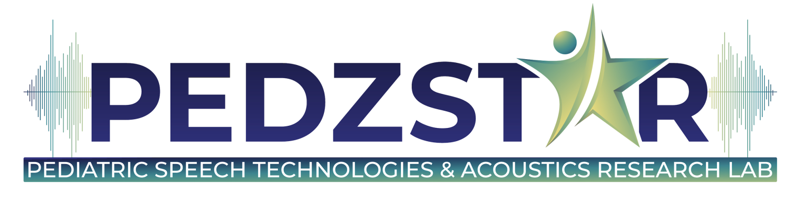

# SPROUT Website

Speech Production Repository for Optimizing Use for AI Technologies (SPROUT)

 

## Overview

The SPROUT (Speech Production Repository for Optimizing Use for AI Technologies) project is designed to support the development of automatic speech recognition (ASR) systems and AI-driven tools for early childhood assessment. SPROUT focuses on collecting speech samples from four-year-old children—a strategic choice that targets the developmental midpoint of speech sound acquisition in American English.

This repository contains the GitHub Pages website for the SPROUT project.

## 🤝 License
See [LICENSE](./LICENSE)
